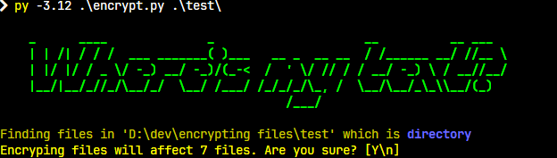
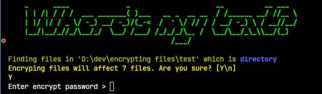
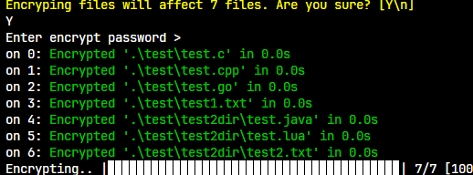
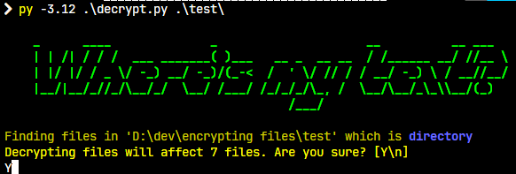
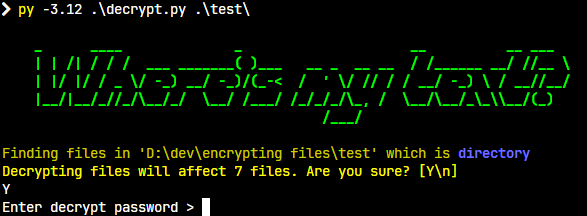
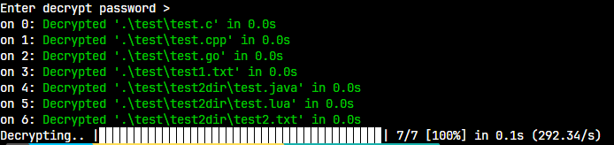

<div align=center>
<a href="https://github.com/Drakvlaa/Where-s-my-text">


</a>
</div>
<h3 align=center>Where's my text?</h3>

<p align=center>
An awesome program to encrypt/decrypt files!
<br />
    <a href="https://github.com/Drakvlaa/Where-s-my-text/issues/new?labels=bug&template=bug-report---.md">Report Bug</a>
      ·
    <a href="https://github.com/Drakvlaa/Where-s-my-text/issues/new?labels=enhancement&template=feature-request---.md">Request Feature</a>
</p>

  <ol>
      <li><a href="#about-the-project">About The Project</a></li>
    <ul>
      <li><a href="#algorithms">Algorithms</a></li>
    </ul>
    <li>
      <a href="#getting-started">Getting Started</a>
      <ul>
        <li><a href="#requirements">Requirements</a></li>
        <li><a href="#installation">Installation</a></li>
      </ul>
    </li>
    <li><a href="#usage">Usage</a></li>
    <ul>
    <li><a href="#encryption">Encryption</li>
    <li><a href="#decryption">Decryption</li>
    </ul>
    <li><a href="#contact">Contact</a></li>
    <li><a href="#-license">License</a></li>
  </ol>

## About the project

**Where's my text?** is a terminal program used to **encrypt** and **decrypt** file contents using [symmetric encryption](https://en.wikipedia.org/wiki/Symmetric-key_algorithm) implemented in [Python](https://www.python.org/).

### Algorithms

Using [SHA256](https://pl.wikipedia.org/wiki/SHA-2) for creating password hash used.  
Using [AES (advanced encryption standard)](https://pl.wikipedia.org/wiki/Advanced_Encryption_Standard) for encrypting and decrypting file contents. For example [Unreal Engine](https://www.unrealengine.com/) uses [AES algorithm](https://pl.wikipedia.org/wiki/Advanced_Encryption_Standard) (optional) for encrypting [UAssets](https://docs.fileformat.com/game/uasset/) in built games.

## Getting Started

### requirements

- Installed [Python 3.12](https://www.python.org/)
- Installed [Git](https://www.git-scm.com/downloads)
- Installed [Pip](https://pypi.org/project/pip/)

### Installation

1. Clone the repo
   ```sh
   git clone https://github.com/Drakvlaa/Where-s-my-text.git
   ```
2. Install Python packages
   ```sh
   pip install -r requirements.txt
   ```

## Usage

#### Encryption

1. Activate encryption script

```sh
py -3.12 -m ./encrypt.py \Path\to\files
```

2. If correct destination was chosen proceed to encrypting by accepting the prompt.
   
3. Enter password for encryption**⚠️SAME PASSWORD WILL BE USED FOR DECRYPTION SO REMEMBER IT⚠️**.
   
4. and there you go, all files in chosen directory got encrypted!
   

#### Decryption

1. Activate dectryption script

```sh
py -3.12 -m ./decrypt.py \Path\To\files
```

2. If correct destination was chosen proceed to decrypting by accepting the prompt.
   
3. Enter same password that you used to encrypt the files
   
4. And there you go, all your files are decrypted!
   

## Contact

[](https://discord.gg/xamjvJUs4b)


## © License

```license
MIT License

Copyright (c) 2024 Filip Sobczuk

Permission is hereby granted, free of charge, to any person obtaining a copy
of this software and associated documentation files (the "Software"), to deal
in the Software without restriction, including without limitation the rights
to use, copy, modify, merge, publish, distribute, sublicense, and/or sell
copies of the Software, and to permit persons to whom the Software is
furnished to do so, subject to the following conditions:

The above copyright notice and this permission notice shall be included in all
copies or substantial portions of the Software.

THE SOFTWARE IS PROVIDED "AS IS", WITHOUT WARRANTY OF ANY KIND, EXPRESS OR
IMPLIED, INCLUDING BUT NOT LIMITED TO THE WARRANTIES OF MERCHANTABILITY,
FITNESS FOR A PARTICULAR PURPOSE AND NONINFRINGEMENT. IN NO EVENT SHALL THE
AUTHORS OR COPYRIGHT HOLDERS BE LIABLE FOR ANY CLAIM, DAMAGES OR OTHER
LIABILITY, WHETHER IN AN ACTION OF CONTRACT, TORT OR OTHERWISE, ARISING FROM,
OUT OF OR IN CONNECTION WITH THE SOFTWARE OR THE USE OR OTHER DEALINGS IN THE
SOFTWARE.
```
